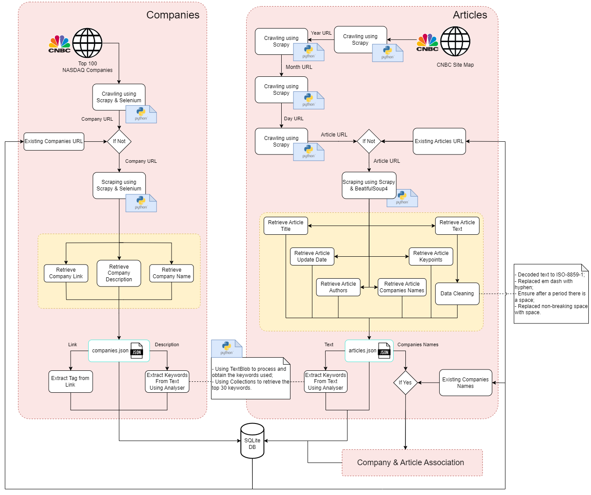

# PRI - Information Processing and Retrieval

## Group G88
| Name             | Number    | E-Mail             |
| ---------------- | --------- | ------------------ |
| Diogo Silva        | 202004288 | up202004288@edu.fe.up.pt   |
| Henrique Silva     | 202007242 | up202007242@edu.fe.up.pt   |
| João Araújo        | 202004293 | up202004293@edu.fe.up.pt   |
| Tiago Branquinho   | 202005567 | up202005567@edu.fe.up.pt   |

---

## Table of Contents

- [Brief Description](#brief-description)
- [Project Milestones](#project-milestones)
- [Milestone 1 - Data Collection and Preparation](#milestone-1---data-collection-and-preparation)
    - [Datasets](#datasets)
    - [Data Characterization](#data-characterization)
    - [Exploratory Data Analysis](#exploratory-data-analysis)
    - [Data Processing Pipeline](#data-processing-pipeline)
    - [Data Domain Model](#data-domain-model)
    - [Documents Classification](#documents-classification)
- [Milestone 2 - Information Retrieval](#milestone-2---information-retrieval)
- [Milestone 3 - Search System](#milestone-3---search-system)

---

## Brief Description

The goal of this project that is going to run the whole semester is to develop an information search engine, which includes work on data collection and preparation, information querying and retrieval, and retrieval evaluation.

## Project Milestones

- [ ] Milestone 1 - **Data Collection and Preparation**. The first milestone is achieved with the preparation and characterisation of the datasets selected for the project. The datasets are the foundation for the project and the goal of the first task is to prepare and explore them. This task is heavily dependent on the datasets, which may require some extraction actions such as crawling or scraping.

- [ ] Milestone 2 - **Information Retrieval**. The second milestone is achieved with the implementation and use of an information retrieval tool on the project datasets and its exploration with free-text queries. This task makes use of state-of-the-art retrieval tools and involves the view of the datasets as collections of documents, the identification of a document model for indexing, and the design of queries to be executed on the indexed information.

- [ ] Milestone 3 - **Search System**. The third milestone is achieved with the development of the final version of the search system. This version is an improvement over the previous milestone, making use of features and techniques with the goal of improving the quality of the search results. For this milestone, we are expected to explore innovative approaches and ideas, and will heavily depend on the context and data. Additionally, an extended evaluation of the results and a comparison with the previous version of the search system is also expected.

---

## Milestone 1 - Data Collection and Preparation

### Datasets

The datasets used in this project are the following:

- [CNBC News - Site map](https://www.cnbc.com/site-map/). The dataset scraped from CNBC contains news articles from the CNBC website, which is a world leader in business news and real-time financial market coverage. The dataset is proven to be reliable and trustworthy, as it is a well-known news website. The dataset is composed of thousands news articles regarding the "Market Insider" topic, starting from 2020 to the present days.

- [CNBC NEWS - Quotes](https://www.cnbc.com/quotes/). This dataset contains quotes from the CNBC website for every stock in the market. The desired quotes are obtained from the previous dataset, as it contains the stock symbol for each news article. The dataset is composed of hundreds of companies.

### Data Characterization

- The utilized data can be divided into two groups: articles and companies information.
- The articles contain:
    - Structured data: list of authors, published and edited date, title, topic
    - Unstructured data: main text, key points
- The companies information contain:
    - Structured data: name, tag
    - Unstructured data: description

### Exploratory Data Analysis

- In this section patterns and outliers were recognized among the two types of data, which were essential to achieve insightful decision-making.
- Some keywords were also extracted from some analysis, in order to ease finding future relations between data.

### Data Processing Pipeline
- The detailed description of both pipelines was made, detailing the steps done regarding both the scrapping and the storage of data.

The process involved in the Company document preparation consists in the following steps:

- **Scraping companies** using Scrapy and Selenium:
    - **Initialization** - a spider from the Scrapy library in Python starts its operation by sending a request to the CNBC NASDAQ 100 webpage.
    - **Parse Company Links** - Selenium (from Python) is used to wait for the links to individual company pages in CNBC to load and extract them.
    - **Parse Company Pages** - in each company page, the "spider" retrieves information such as the company name and description. In this case, there is some interaction (Selenium) by clicking on a ’More’ button that expands the description itself.
    - **Store Data** - the extracted data is yielded as output by the spider, being stored in the `companies.json` file.
- **Storing company data** into the SQLite database:
    - **Read JSON Data** - the `companies.json` file is opened and read.
    - **Extract Keywords** - the Analyzer class added uses the TextBlob Python library to obtain the most frequent noun phrases in the company’s description, generating a concise set of keywords that can bring value to the application later.
    - **Get Company Tags** - each company’s tag is obtained from its link.
    - **Insert Companies into Database** - a company instance is created in the database with attributes link, tag, name and description.

The process involved in the Article document preparation consists in the following steps:

- **Scraping articles** using Scrapy and BeautifulSoup4:
    - **Initialization** - a "spider" from the Scrapy library in Python starts its operation by sending a request to the CNBC sitemap webpage, retrieving a list of years.
    - **Parse Years Links** - The previous library is used to iterate among several months of information, inside a certain year.
    - **Parse Months Links** - The previous library is used to iterate among several days of information, inside a certain month.
    - **Parse Days Links** - The previous library is used to iterate among several articles of information, inside every day. An article’s URL is opened if its title matches the format wanted and if it isn’t on the database yet.
    - **Parse Article Pages** - in each article page, the spider retrieves information such as the title, authors, publish and edition date, key points and main text, which is fetched using BeautifulSoup. That library also allows access to the companies mentioned in that article.
    - **Store Data** - the extracted data, including the mentioned companies, is yielded as output by the spider, being storedn in the `articles.json` file.
- **Storing article data** into the SQLite database:
    - **Read JSON Data** - the `data/articles.json` and the `data/companies.json` files are opened and read.
    - **Extract Keywords** - the Analyzer class added uses the TextBlob Python library to obtain the most frequent noun

### Data Domain Model

- The domain model was created, in order to have a better understanding of the data and its relations.

<figure>
    
<figcaption>Domain Model</figcaption>

### Documents Classification

- At an intermediary stage in the pipeline, there are two document
collections, prepared and created after the scraping process. In
both cases, the documents are JSON objects and the collections
themselves JSON files.

- At a final stage, there are these main document collections, each one being a table in a SQLite database (in articles.db)
    - Company
    - Article
    - CompanyArticleAssociation

<figure>
    
    <figcaption>Database articles.db UML</figcaption>
</figure>

## Usage

### Requirements

- We used Python 3.10/11 to develop this project, but any version above 3.8 should work.
- Install the required packages with `pip install -r requirements.txt`.
- Have make installed.

### Scraping

- Open a terminal in the root of the project.
- Run `make all` to proceed to install the required packages and dependencies under a virtual environment.
- Run `make run` to start the scraping process.
- You can also use `run_reading`, `run_year_2020` and `run_cleaning` to run reading first the stored data, run from the year 2020 and clean the data, respectively.
- To test further functionalities, you can update the makefile with the desired commands. The arguments to be used can be seen in the `Makefile` file.

## Milestone 2 - Information Retrieval

TODO

## Milestone 3 - Search System

TODO

