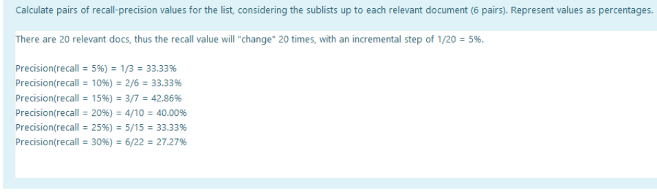

# PRI - Exam 2020

## Information Retrieval Systems and Tasks

### 1.

In IR, it is common to identify tasks to be accomplished by an automatic system. Consider the description of the following information processing problems and select one that can be solved by an IR system.
- [ ] *Catalog Search*. Use a web form to search the catalog of products from a company information system.
- [x] *Enterprise Information*. Perform keyword search on the documents generated internally by an organization.
- [ ] *Interaction with an automatic answering system*. Find the answer to a user query following the branches of a multiway tree used by an automatic answering system.
- [ ] *Personnel Information*. Export, from an institutional database, personnel records.

### 2.

An IR system is composed of several modules contributing to data processing, retrieval, result ranking, and user interface. From the following functions, select the one which has NOT a central role in the modules of an information retrieval system.
- [ ] Building inverted indexes, based on terms extracted from documents.
- [ ] Text processing, identifying words and other lexical elements, to build a vocabulary.
- [x] Classifying documents, assigning them categories according to the domain of the documents in the collection.
- [ ] Calculating scores for documents in answer, suing the query, the index and user context.

### 3.

IR tasks capture the different collection types, interaction modes and expected results from a retrieval system. Which of the following is NOT an IR task?
- [ ] *Medical Records*: system that explores methods for searching unstructured information found in patient medical records.
- [ ] *Complex Answers*: system that is capable of answering complex information needs by collating relevant information from an entire corpus.
- [ ] *Real-Time Summarization*: system that constructs real-time update summaries from social media streams in response to users' information needs.
- [x] *Time-bound Query Efficiency*: system that queries a database and gets the list of documents created during a range of dates in less than a prescribed time.

### 4.

Relevance is a central concept in IR. Which of the following definitions captures its meaning?
- [x] A document is relevant if it satisfies the information need that started the search process.
- [ ] A document is relevant if it has a large PageRank value.
- [ ] A document is relevant if it is included in the top 10 results in the answer of an IR system.
- [ ] A document is relevant if the user picks it from the results page and reads it.

## Indexing and Searching

### 5.

In an IR search tool, the concept of document is central. Select one of the following statements as true for a document in an IR system.
- [ ] A document is a resource (text or otherwise) which is freely available on the Web.
- [ ] A document is a resource (text or otherwise) that has links to and from other resources.
- [ ] A document is a resource (text or otherwise) or set of resources that are indexed as a single unit in the IR system.
- [ ] A document is a resource (text or otherwise) obtained from a reliable source.

### 6.

In IR, it is common to say that documents are *bags of words*. Select one of the following explanations for the use of this metaphor.
- [x] ***Not really sure*** Common information retrieval models do not take into account the structure of phrases in a document.
- [ ] In IR systems the meaning of words is lost in the documents is important.
- [ ] IR systems do not deal with the actual documents from the collection but with terms that may come from different documents.
- [ ] Indexes built for the text collections order the terms in their vocabularies in alphabetical order.

### 7.

What is an invertex index?
- [ ] An invertex index is a table with all the terms that occur in all the documents of the collection.
- [ ] An invertex index is a matrix of terms versus documents where a cell value equals the weight of the term in the document if the terms occurs in the document and 0 otherwise.
- [x] An invertex index is a data structure linking each vocabulary term to a list of occurrences of the term in the documents.
- [ ] An invertex index is a matrix of terms versus documents where a cell has value 1 if the term occurs in the document and 0 otherwise.

### 8.

In document indexing, the different word forms occuring in the document may appear in the vocabulary as different terms, or they may be pre-processed to normalized terms. For instance, we can remove verbal forsm and word variationsfor gender or number. How do we expect word pre-processing to affect the search results?
- [ ] If term pre-processing is used, answers have equal or better precision than if it is absent (i.e. the number of non-relevant documents in the answer is the same or lower).
- [ ] Term pre-processing reduces the number of non-relevant documents in the answer.
- [ ] Term pre-processing has no effect on the quality of the answer, but makes the system more efficient.
- [x] New documents may appear in the answer as a result of word pre-processing.

**Explanation**: Pre-processing terms may lead to the occurence of new terms in the vocabulary, but **does not means that new documents will appear** and even those that appear may not be relevant.

### 9.

Term weighting in the vector model uses the *tf* (Term-Frequency) measure. What does a *tf* value represent?
- [ ] The number of times a term occurs in the collection.
- [ ] 1 or 0, depending on whether the term occurs in the document or not.
- [x] The number of times a term occurs in the document.
- [ ] The number of documents where the term occurs.

### 10.

Term Weighting in the vector model uses the *idf* measure. What does the *idf* value for a term represent?
- [ ] The percentage of documents in the dollection which do not include the term.
- [x] The rarity of the term in the collection.
- [ ] The maximum frequency of the term, considering each document in the collection.
- [ ] The frequency of the term in the collection.

### 11.

The *idf* measure is a common component of term weighting schemes. What is the *idf* of a term that occurs in every document?
- [ ] This value depends on the number of documents in the collection.
- [ ] 1.
- [x] 0.
- [ ] Infinity.

**Explanation**: The *idf* of a term that occurs in every document is 0 because the logarithm of 1 is 0. To remind, the formula is .

### 12.

In the vector model, documents and queries are represented as vectors in an n-dimensional space. What is the dimension of the space?
- [ ] The number of documents in the collection.
- [ ] The number of index terms times the number of documents in the collection.
- [x] The number of index terms.
- [ ] The number of different words extracted from the documents in the collection.

### 13.

In the vector model, documents are ranked based on a score that measures the similarity between the document and the query. How is the similarity score computed?
- [ ] The similarity measure is the number of terms in common between the document and the query.
- [x] The similarity measure is the cosine of the angle formed by the document and the query vectors.
- [ ] The similarity measure is the ratio between the Euclidean norms for the query and the document.
- [ ] The similarity measure is the difference between the Euclidean norms of the document and the query vectors.

**Explanation**: The cosine similarity is the ratio between the dot product of the document/query vectors and the product of their Euclidean norms.

## Information

### 14.

A user is choosing between systems A and B, for a task that requires some relevant documents at the top of the results list. Which system would you recommend?
- [ ] I recommend system B, because (on average) precision has little variation with the recall level.
- [ ] I recommend system B, because it can guarantee a relevant result at the top of the results list.
- [ ] I recommend system A, because it has a better average ordering of results in the answer.
- [x] I recommend system A, because it sxhibits 100% precision at the first recall level.

### 15.

Consider a user who is comparing systems A and B for information needs that require all relevant documents in the collection to be retrieved. WHich of the following statements is true?
- [ ] The user is expected to find all relevant documents in both systems; with system A the total number of documents to be analyzed will be smaller.
- [ ] The user is not expected to retrieve all relevant documents in any of the systems.
- [ ] The user can select any of the systems and will find all relevant documents; we cannot tell chich of the systems will make the task easier.
- [x] With system A the user is not expected to find all relevant documents.

### 16.

The *recall* ratio is used in the evaluation of information retrieval systems. How do we define recall for an information need (*IN*) and a results list?
- [ ] Recall is the percentage of the documents relevant for IN in the collection which are present in the top 10 results in the results list.
- [ ] Recall is the percentage of documents in the results list which are relevant for IN.
- [ ] Recall is the number of documents relevant for IN in the collection which are present in the top 10 results in the results list.
- [x] Recall is the percentage of the documents relevant for IN in the collection which are present in the results list.

### 17.

The *precision* ratio is used in the evaluation of information retrieval systems. How do we define precision for an information need (*IN*) and a results list?
- [x] Precision is the percentage of documents in the results list which are relevant for IN.
- [ ] Precision is the percentage of documents relevant for IN in the collection which are present in the results list.
- [ ] Precision is the percentage of documents relevant for IN in the collection which are present in the top 10 results in the results list.
- [ ] Precision is the number of documents relevant for IN in the collection which are present in the top 10 results in the results list.

### 18.

The *mean average precision* (MAP) metric is used in the evaluation of information retrieval systems; it is based on the ranked lists of results for a set of information needs. Which of the following is true for MAP?
- [x] MAP takes into account, for each information need, the precision calculated at each new relevant results.
- [ ] MAP takes into account, for each information need, the precision calculated at each standard recall level.
- [ ] MAP is a mean precision for a set of information needs, and for each information need it averages the precision at the standard recall levels.
- [ ] MAP is the average Precision-Recall graph, based on the P-R graphs at the standard recall levels for each information need.

### 19.

### 20.

### 21.

IN on the web have been classified in three categories: "informational", "transactional", and "navigational". According to this distinction, select the FALSE statement from the list.
- [x] When responding to an "informational" search the retrieval tool does not use the authority information of the candidate results.
- [ ] The results presented by a search tools in response to popular "navigational" queries are pre-computed.
- [ ] A web user evaluates differently a search result depending on the "informational", "transactional", and "navigational" nature of the IN.
- [ ] Detecting "transactional" IN is important for the comercial activity of a search engine.

### 22.

Web search and search in institutional collections ("enterprise search") use similar tools but also exhibit substantial differences. In the following list of differences, select the one which has stronger implications in the configuration of the search tool.
- [x] A controlled collection versus a non-controlled one.
- [ ] Long documents versus short documents.
- [ ] Documents in the same language versus documents in multiple languages.
- [ ] Specialized users versus lay users.

### 23.

Multimedia resources (./exam-2020-images/images, video) are now regularly included in generalist search, in what has come to be called "universal search". Including images in the saerch engine index requires their association to search terms. Which of the following strategies is NOT used to include multimedia in a document index?
- [ ] The text content of the document which includes the multimedia resource is used for describing it.
- [ ] The anchor text in links to the multimedia resource is associated to it.
- [x] Multimedia resources are manually described using crowdsourcing.
- [ ] The tags assigned to a multimedia resource are associated to it.

### 24.

The anchor text for a hyperlink is used by search engines. Select a reason for this text to be especially interesting when indexing web pages.
- [ ] The existence of the hyperlink allows the use of terms in the target page to index the source page.
- [ ] Terms in the anchor text are carefully chosen by page authors.
- [x] Text in the anchor provides a description of the target page by the author of another page.
- [ ] Pages with many links have few text of their own and so anchor text is used instead.

### 25.

Ranking functions in web search engines take into account a large number of features (signals) obtained from documents, their context, and the user. Select from the following features one that is **NOT** possible to use for including in a ranking function.

- [ ] Data from the user (e.g. web browser version, location, time of day, etc).
- [ ] Date of the page.
- [x] Total number of visits to the page (e.g. direct visits, visits from other search engines, etc).
- [ ] Number of in-links (links to the page) and out-links (links from the page).

**Explanation**: The total number of visits is not available to the search engine (and if it was, it is easy to tamper with).

### 26.

Several studies of the web have shown an overall "bowtie" structure with large components that have been named SCC (strongly connected component, the knot), IN and OUT (the "lobes"), as well as several additional smaller sets of nodes. The following relation holds between the SCC, IN and OUT components:
- [ ] Following page links, one can get from any page in SCC to any page in IN.
- [x] Following page links, one can get from any page in SCC to any page in OUT.
- [ ] Following page links, one can get from any page in OUT to any page in SCC.
- [ ] Following page links, one can get from any page in IN to any page in OUT.

### 27.

In web retrieval, the quality of documents is quite diverse, and therefore content analysis alone si not enough to provide a good ranking of search engine results. What is the general approach to solve this?
- [ ] Document content is used to select results which are then ranked according to a commercial model.
- [x] The score for a document is calculated as a combination of signals, including content-based metrics, the position of query words in documents, and the domain where the documents are from.
- [ ] Content-based scores are replaced by PageRank.
- [ ] Documents are ranked by popularity, as measured by click-through.

## Information

Link Analysis

### 28.

The use of link analysis in web information retrieval has its origin in the study of the impact of scientific publications based on their citation record. In the following, mark the statement that captures an assumption in web link analysis.
- [x] A link from page P1 to Page P2 (an in-link in page P2) represents a vote cast by page P1 on page P2. 
- [ ] A link from page P1 to Page P2 (an in-link in page P2) represents a vote cast by page P2 on page P1. 
- [ ] A link from page P1 to Page P2 means that the authors of P1 agree with the content of P2.
- [ ] If there is a link between page P1 to Page P2, their scores in the web graph are similar.

## Information

### 29.

### 30.

### 31.

### 32 - 35. 
Are related to the [project](./exam%202020.pdf)

