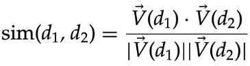
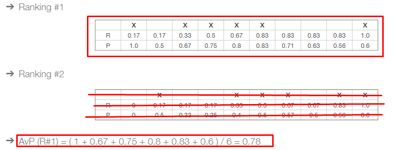
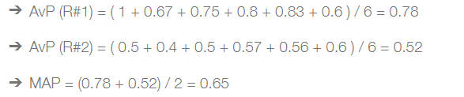
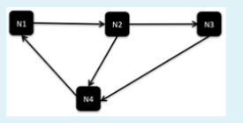
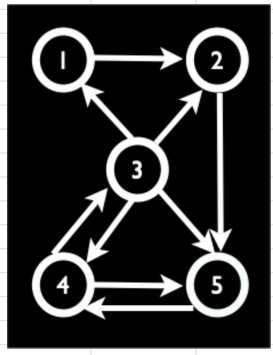

# Topics

The following topics are covered in this exam:

- [Information Processing](#information-processing-concepts--techniques) (Q1-Q12)
- [Information Retrieval](#information-retrieval-tasks-systems) (Q13-Q17)
- [Information Retrieval](#information-retrieval-concepts) (Q18-Q29)
- [Vector Model](#vector-model-tf-idf-scoring-etc) (Q30-Q33)
- [Evaluation](#evaluation-calculate-recall-and-precision-draw-p-versus-r-curves-with-average-interpolated-precision-calculate-map) (Q34-Q43)
- [Web Search](#web-search) (Q44-Q51)
- [Web Retrieval and Link Analysis](#web-retrieval-and-link-analysis-pagerank-hubs-and-authorities) (Q52-Q54)
- [Learning to Rank](#learning-to-rank-using-machine-learning-in-the-retrieval-process) (Q55-Q56)
- [Neural Information Retrieval](#neural-information-retrieval-dense-vectors-embeddings-using-neural-models-in-the-retrieval-process) (Q57-Q61)
- [Query Processing](#query-processing-query-processing-techniques-and-relevance-feedback-strategies) (Q62-Q65)
- [Entity-oriented Search](#entity-oriented-search-producing-entity-descriptions-entity-ranking-and-entity-linking) (Q66-Q68)
- [Search User Interfaces](#search-user-interfaces-user-interaction-with-search-systems-interaction-elements) (Q69-Q71)
- [Solr](#solr-indexing-and-retrieval-configuration-query-processing-relevance-feedback-learning-to-rank-entity-oriented-search-user-interfaces)
- [Project](#project-document-collection-indexing-retrieval-evaluation-user-interfaces-relevance-feedback-learning-to-rank-entity-oriented-search)


## Information Processing: Concepts & Techniques

### Q1: What is *data*, *metadata*, and *information*?
- [x] *data*: raw facts; *metadata* data about data; *information*: data with meaning.
- [ ] *data*: data with meaning; *metadata* data about data; *information*: raw facts.
- [ ] *data*: raw facts; *metadata* is the content of data; *information*: enables decision making & has been processed.

### Q2: Identify and describe the phases of the information processing lifecycle.
- [x] The information processing lifecycle consists typically of the **continuous** phases: *create/generate*, *collect*, *record/store*, *process*, *distribute/transmit*, *consume/use* and *dispose*.
- [ ] The information processing lifecycle consists typically of the **discrete** phases: *create/generate*, *collect*, *record/store*, *process*, *distribute/transmit*, *consume/use* and *dispose*.
- [ ] The information processing lifecycle consists typically of the phases, in order: *record/store*, *collect*, *process*, *distribute/transmit*, *consume/use* and *dispose*.

**Explanation**:

The information life cycle is the **continuous** process of creating/generating, collecting, recording/storing, processing, distributing/transmitting, consuming/using and disposing of information. After the usage phase, new information (or even the same), can be inserted into the system, and the cycle starts again.

### Q3: What are the **3** main stages of *Data*?
- [x] *raw*: focus on discovering the data itself; *processed/refined*: data is prepared for analysis; *production*: data is used into production processes;
- [ ] *raw*: focus on discovering the data itself; *processed/refined*: data is prepared and doesn't require further processing; *production*: data is used into production processes;
- [ ] *clean*: data is cleared from nullable values (e.g. defaults values to 0); *processed/refined*: data is prepared and doesn't require further processing; *production*: data is used into production processes;

Data moves through three main stages:
- Raw: focus is on data discovery.
- Refined: focus is on data preparation.
- Production: focus is on integrating data into production.

### Q4: What are the main stages of the ETL pattern?
- [x] *Extract*: data is extracted from the source; *Transform*: data is transformed into the desired format; *Load*: data is loaded into the destination (e.g. database, json file).
- [ ] *Extract*: data is extracted from the source; *Load*: data is loaded into the destination; *Transform*: data is transformed into the desired format.

### Q5: What are the benefits of using ELT over ETL?
- [x] **ELT** allows to load data into the destination first, and then transform it. This way, an engineer can extract the data, while the analyst can transform it.
- [ ] **ELT** decouples responsabilities but it is not capable of handling large amounts of data, unlike **ETL**.

### Q6: What is the different between ELT and EtLT?
- [x] **EtLT** adds a *transform* step between *extract* and *load*, which is associated with data cleaning tasks.
- [ ] **EtLT** adds a *load* step between *extract* and *transform*, which is associated with data cleaning tasks.
- [ ] **EtLT** adds a *transform* step between *extract* and *load*, which is the major transformation step, where data is usually transformed and processed.

### Q7: Describe OSEMN framework.
- *Obtain*: data is obtained from the source; 
- *Scrub*: data is cleaned and prepared;
- *Explore*: data is explored and visualized;
- *Model*: data is modeled and analyzed;
- *Interpret*: results are interpreted and communicated.

### Q8: Describe the challenges associated with data processing.
- **Ownership**: know what data you have access to and what you can do with it
- **Ingestion interface and structure**: how do you get the data and in what form is in
- **Volume**: too much data or too little data is not good
- **Cleanliness and validity**: duplicate data, missing or incomplete data, encoding, etc.
- **Latency and bandwidth of the source**: need to consider internal update requirements and also source system limits, speed, timeouts, etc.
- **Data selection**: is the author trustable, is the data updated

### Q9: Identify and describe challenges and techniques related to **data cleaning**

- Missing data (null values)
- Inconsistent values (e.g. different units)
- Precision problems (rounds can cause problems, e.g. rounding coordinates of a map)
- Duplicate values
- Encoding problems (e.g. UTF-8, ASCII, etc. can cause problems if not handled correctly)
- Data type problems (e.g. string instead of int)
- Outdated data

### Q10: Identify and describe challenges and techniques related to **data preparation**

Regarding Data Preparation, up to 80% of the time spent, are in data preparation tasks. We have the following stages:
- **Cleaning**
- **Transformation**, which includes:
    - Normalization (e.g. converting to lowercase);
    - Scaling values to a specific range (e.g. 0-1);
    - Encoding (e.g. one-hot encoding);
    - Binning (e.g. grouping values into bins of size X);
- **Synthetization** of new data (e.g. create a new column from combination of two columns);
- **Integration** (e.g. combining data from multiple sources);
- **Reduction** (e.g. removing outliers, redundant or even not useful data). Includes:
    - Filtering
    - Sampling
    - Aggregation

After preparing the data (and even while preparing it), we **should/must** explore it, e.g. using visualizations, graphs, etc.

### Q11: Identify and describe challenges and techniques related to **data presentation**

- charts for numerical data
- time-series to represent data over time
- maps to represent geographical data
- words clouds to represent textual data (highlights most frequent words)

### Q12: Describe the importance of data pipelines and how Makefiles can be used to implement them.

Data pipelines are sets of processes that move and transform data from various sources to various destinations where new value can be derived. <br>
Data pipelines must be reliable, scalable and maintainable.

Makefiles are used to automate software build processes, by defining targets and rules to execute. The underlying abstraction is of a dependency graph, where tasks depend on the execution of other tasks. <br>
Make is able to automatically decide what to execute based on direct or indirect dependencies to files that have changed.

## Information retrieval: tasks, systems

### Q13: What is the difference between *information retrieval* and *data retrieval*?
- [x] *Information retrieval* is the process of obtaining information from a collection of documents, while *data retrieval* is the process of obtaining data from a database.
- [ ] *Information retrieval* is the process of obtaining data from a database, while *data retrieval* is the process of obtaining information from a collection of documents.
- [ ] Both can be used for relevance ranking, i.e. to rank the most relevant results first.

### Q14: Give examples of IR and data retrieval systems.
- [x] IR: Google, Bing, Yahoo, etc.; data retrieval: SQL, NoSQL, etc.
- [ ] IR: SQL, NoSQL, etc.; data retrieval: Google, Bing, Yahoo, etc.

### Q15: Give some examples of retrieval tasks evaluated in TREC.
- **Ad Hoc Search**: most common type of search, where the user is looking for information on a specific topic, e.g. on Google.
- **Filtering**: identify relevant user profiles for a new document. 
- **Classification**: identify relevant labels for documents. 
- **Question answering**: give specific answer to a question.

### Q16: Give some examples of IR applications.
- **Web Search**: most common type of search, where the user is looking for information on a specific topic, e.g. on Google.
- **Vertical Search**: focuses on a specific domain, e.g. searching for a specific product on Amazon. The results aren't limited to "documents", e.g. a game result, a product, etc.
- **Enterprise Search**: performed on a company's intranet, e.g. searching for a document.
- **Desktop Search**: performed on the user's computer, e.g. searching for a file.

### Q17: What are the modules of an IR system?
- **Document Acquisition**: obtain documents from various sources, e.g. web, database, etc. (using crawlers).
- **Document Processing**: process the documents, e.g. remove stop words, stemming, etc.
- **Indexing**: create an index of the documents, e.g. inverted index.
- **Query Processing**: process the query, e.g. remove stop words, stemming, etc.
- **Ranking**: rank the documents based on the query, e.g. using the vector space model.
- **Results Presentation**: present the results to the user, e.g. using a web interface.

## Information retrieval: concepts

### Q18: What is a document?

Documents can be web pages, email messages, books, news articles, research papers, computer files (PDF, Word, text). They are different from records in a database, because they can be unstructured.

### Q19: What is a collection?

A collection is a set of documents. It can be a set of web pages, a set of news articles, etc.

### Q20: What is a term?

A term is a word or a phrase. It can be a single word, e.g. "information", or a phrase, e.g. "information retrieval". It is the basic unit of indexing.

### Q21: What is a bag of words?

A bag of words is a set of terms. It can be a set of single words, e.g. {"information", "retrieval"}, or a set of phrases, e.g. {"information retrieval", "information processing"}. Usually comes with a frequency, e.g. {"information": 2, "retrieval": 1}, and fully ignores the order of the words.

### Q22: What is stemming?

Stemming is the process of reducing inflected (or sometimes derived) words to their word stem, base or root form. For example, the words "information", "informative" and "informed" all have the same stem, "inform".

### Q23: What is an invertex index?

An inverted index is an index data structure storing a mapping from content, such as words or numbers, to its locations in a database file, or in a document or a set of documents. E.g. Brutus −→ [1 → 2 → 4 → 11], which are the documents where the word "Brutus" appears. 

The **Basic** approach also stores the frequency in each document. <br>
The **Positional** approach stores the position of the term in each document instead. e.g. Brutus −→ [1 → [2, 4, 5] 2 → [1, 5, 11]...]

### Q24: What are Stop words?

Stop words are words which are filtered out before or after processing of natural language data (text). They are usually the most common words in a language, e.g. "the", "a", "an", "in", etc.

### Q25: What is Tokenization?

Tokenization is the process of breaking a stream of text up into words, phrases, symbols, or other meaningful elements called tokens. The list of tokens becomes input for further processing such as parsing or text mining.

### Q26: What is a vocabulary?

A vocabulary is a set of terms.

### Q27: What is a postings list?

A postings list is a list of documents where a term appears. E.g. Brutus −→ [1, 2, 4, 11]

### Q28: What is an Information Need (IN)?

An information need is a statement of information need, e.g. "I want to know about X", which is usually expressed as a query (which might not express the information need correctly).

### Q29: What is a relevant result in a results list?

A relevant result is a result that satisfies the IN.

## Vector Model: tf, idf, scoring, etc..

### Q30: What is Term Frequency (tf)?

**Term Frequency** is the number of times a term appears in a document. E.g. in the Bag of Words {"information": 2, "retrieval": 1}, the tf of "information" is 2.

### Q31: What is the Inverse Document Frequency (idf)?

**Inverse Document Frequency** is the weighted value of the  number of documents where a term appears.<br>  <br>
E.g. in the Inverted Index {"information": [1, 2], "retrieval": [1]}, the df of "information" is 2, and the idf is log(2/2) = 0.
<br>The lower the **df**, the higher the **idf**.

### Q32: What is the tf-idf?

The **tf-idf** is higher when the term appears more frequently in a given document, but appears less frequently in the collection. <br>


### Q33: What is the cosine similarity / How do you rank documents in the vector model?

The **cosine similarity** is a measure of similarity between two **non-zero** vectors of an inner product space that measures the cosine of the angle between them. <br> 

E.g. It is used to compare between documents, or between a document and a query.

Example:
<br>Query: "portugal election"
<br>Document 1: "portugal election"
<br>Document 2: "portugal results"
<br>Document 3: "election portugal election"

| Term | Query | Document 1 | Document 2 | Document 3 |
| --- | --- | --- | --- | --- |
| portugal | 1 | 1 | 1 | 1 |
| election | 1 | 1 | 0 | 2 |

These correspond to the vectors H1 = [1, 1], H2 = [1, 0] and H3 = [1, 2] respectively. 

From here, we have |H1| = sqrt(2), |H2| = 1 and |H3| = sqrt(5).

Now we can calculate the cosine similarity between the query and each document:

- H1: (1 * 1 + 1 * 1) / (sqrt(2) * 1) = 1.41
- H2: (1 * 1 + 1 * 0) / (1 * 1) = 1
- H3: (1 * 1 + 1 * 2) / (sqrt(2 * 5)) = 0.94

Which leads to the following ranking: H1 > H2 > H3.

### Test exercices 6.8, 6.9, 6.10, 6.11, 6.15, 6.16, 6.17 and Examples 6.2, 6.3, 6.4. from the book ([page 156](../books/Introduction%20to%20Information%20Retrieval%20(Manning%20et%20al.,%202008).pdf#page=156))

## Evaluation: calculate recall and precision, draw P versus R curves (with average interpolated precision), calculate MAP

### Q34: What is Recall?

**Recall** is the fraction of relevant documents that are retrieved.

### Q35: What is Precision?

**Precision** is the fraction of retrieved documents that are relevant.

### Q36: What is Interpolated Precision?

**Interpolated Precision** is the maximum precision obtained for any recall value greater than or equal to the current recall value. E.g. if the precision for recall 0.5 is 0.7 and at 0.6 is 0.8, then the interpolated precision for recall 0.5 is 0.8.

### Q37: What is the F measure?

The **F measure** is the harmonic mean of precision and recall. F = 2 * (P * R) / (P + R)

### Q38: What is the average precision?

The **average precision** is the average of the precision values obtained after each relevant document is retrieved.
<br>

### Q39: What is the mean average precision (MAP)? Is it calculated for each query or for the whole collection?

The **mean average precision** is the average of the **average precision** values obtained after each relevant document is retrieved.
<br>

It is calculated for each query and then averaged over all queries.

### Q40: What is the P versus R curve?

A graph that plots the precision values against the recall values. It is used to compare the performance of different retrieval systems. A good system will have a curve that is closer to the top-right corner.

### Q41: What is the R-precision?

The **R-precision** is the precision value obtained after R documents are retrieved, where R is the **number of relevant** documents in the collection.

### Q42: What are the components of a test collection?

- **Documents**: the collection of documents.
- **Queries**: the set of queries.
- **Relevance Judgements**: the set of relevant documents for each query (either relevant or non-relevant, for the binary/standard assessment).

### Q43 Test exercices 8.1, 8.4, 8.8 and 8.9 from the book ([page 194](../books/Introduction%20to%20Information%20Retrieval%20(Manning%20et%20al.,%202008).pdf#page=194))

## Web Search

### Q44: What is a web crawler?

A web crawler is a program that automatically traverses the web by downloading pages and following links from page to page. It is also known as a spider, robot, or web bot.

### Q45: What are informational, transactional and navigational IN's?

- **Informational**: the user is looking for information on a specific topic, e.g. "portugal election".
- **Transactional**: the user is looking to perform a transaction, e.g. "buy iphone 15".
- **Navigational**: the user is looking for a specific website, e.g. "facebook".

### Q46: What defines web spam?

Web spam is the use of techniques that attempt to manipulate search engine rankings. It can be classified as **content spam** (e.g. keyword stuffing, hidden text, etc.) or **link spam** (e.g. link farms, link exchanges, etc.).

### Q47: Name some differences between web search and enterprise search.

- **Web search** is performed on the web, while **enterprise search** is performed on a company's intranet.
- **Web search** is performed by anyone, while **enterprise search** is performed by employees of the company.
- **Web search** use http, while **enterprise search** can search through databases, emails, etc.

### Q48: How do you index images?

Images can be indexed by using the **alt** attribute of the **img** tag, which is used to specify an alternate text for an image, if it cannot be displayed. This text is also used for web accessibility, e.g. for blind people.

### Q49: What defines a good crawler?

They start by searching for URLs in a **seed set** (e.g. a list of URLs), and then follow the links in the pages.<br>
- **Robustness**: the crawler should be able to handle errors, e.g. 404, 500, etc.
- **Politeness**: the crawler should not overload the server, e.g. by sending too many requests.
- **Freshness**: the crawler should be able to detect changes in the web pages, e.g. by using the **last-modified** header.
- **Duplicate detection**: the crawler should be able to detect duplicates, e.g. by using a hash function.

### Q50: Give examples of Ranking Signals used by search engines.

- **PageRank**: the importance of a page is determined by the number of pages that link to it.
- **Anchor text**: the text used in the links to a page.
- **Content**: the content of the page.

### Q51: What are the SCC, IN and OUT components of a web graph?

- **SCC**: Strongly Connected Components, i.e. a set of pages where there is a path from each page to every other page.

- **IN**: the set of pages that link to a page.

- **OUT**: the set of pages that a page links to.

One can get from the SCC to any OUT page, and from any IN page to the SCC.

## Web retrieval and link analysis: PageRank, hubs and authorities

### Q52: What are in-links and out-links for a web page?

- **In-links**: the set of pages that link to a page.
- **Out-links**: the set of pages that a page links to.

### Q53: PageRank algorithm

The **PageRank** algorithm is used to rank the importance of pages in a web graph. It is based on the idea that important pages are linked to by other important pages. 
E.g.  <br>
PR(N4) = 1/2*PR(N2) + PR(N3)

### Q54: HITS algorithm

Every **edge** starts with a weight of 1. <br>
On every iteration, the **authority** of a page is the sum of the **hub** values of the pages that link to it, and the **hub** of a page is the sum of the **authority** values of the pages that it links to (for iteration 1, is simply the number of in/out-links). <br><br>
On iteration 1:
```
Auth Score/Hub Score:
P1: 1/1
P2: 2/1
P3: 1/4
P4: 2/2
P5: 3/1
```

## Learning to Rank: using machine learning in the retrieval process

### Q55: What is Learning to Rank?

**Learning to Rank** is the application of machine learning to the construction of ranking models for information retrieval systems. It is used to rank the results of a query.

### Q56: What are the main approaches in LTR? How do they differ in terms of input and output data?

- **Pointwise**: the input is a **single** document, and the output is a score for that document.
- **Pairwise**: the input is a **pair** of documents, and the output is a score for each document, comparing to each other against the query.
- **Listwise**: the input is a list of documents, and the output is a permutation of that list.

## Neural Information Retrieval: dense vectors, embeddings, using neural models in the retrieval process

### Q57: What is Neural Information Retrieval?

**Neural Information Retrieval** is the application of neural networks to the construction of ranking models for information retrieval systems. It is used to rank the results of a query.<br>
Can use **Shallow NN** or **Deep NN**. **Dense Vectors** are vectors with most of the values being non-zero, while **Sparse Vectors** are vectors with most of the values being zero. **Embeddings** are dense vectors that represent words (of low dimensionality). **BERT** is a deep neural network that can be used for NLP tasks, e.g. used by Google.

### Q58: How can neural models be used in the retrieval process?

Neural models can be used to learn the relevance of a document to a query by comparing the vector representations of the query and the document.

### Q59: What are document embeddings?

**Document embeddings** are dense vectors that represent documents.

### Q60: What is semantic search?

**Semantic search** is a search technique that improves search accuracy by understanding the searcher's intent and the contextual meaning of terms. E.g. searching for "apple" can return results about the fruit or the company.

### Q61: What is the difference between Learning to Rank and Neural Information Retrieval?

The main difference is that **Learning to Rank** uses machine learning, while **Neural Information Retrieval** uses neural networks.

## Query processing: query processing techniques and relevance feedback strategies

### Q62: Describe and distinguish between the two query processing techniques — document-at-a-time and term-at-a-time.

- **Document-at-a-time**: for each document, compute the score for each query term, and then sum the scores for all query terms.
- **Term-at-a-time**: for each query term, compute the score for each document, and then sum the scores for all documents.

### Q63: In what contexts is query transformation / expansion advantageous?

Query transformation/expansion is advantageous when the query is too short and may not contain enough context, e.g. "portugal election", which can be expanded to "portugal election results".

### Q64: What techniques can be used to apply transformations / expansions to user queries?

- Use **synonyms** or automatically expand the query using the context, e.g. "portugal election" can be expanded to "portugal election results".

### Q65: Identify and describe query expansions techniques, such as relevance feedback or pseudo-relevance feedback.

- **Relevance feedback**: the user is asked to mark the results as relevant or non-relevant, and then the query is expanded using the relevant results. Can use the **Rocchio algorithm** to expand the query (useful to increase the recall).

- **Pseudo-relevance feedback**: the top results are assumed to be relevant, and then the query is expanded using the relevant results.

## Entity-oriented search: producing entity descriptions, entity ranking and entity linking

### Q66: What is entity-oriented search? What is necessary to implement it?

**Entity-oriented search** is a search technique that focuses on entities, e.g. people, places, organizations, etc. It is necessary to have a **knowledge base** (e.g. Wikipedia) and a **Named Entity Recognizer (NER)**.

### Q67: Describe the challenges and techniques associated with… building entity descriptions, entity ranking, entity linking.

- **Building entity descriptions**: the entity description is usually the first paragraph of the Wikipedia page of the entity. It can be improved by using **entity embeddings**.

- **Entity ranking**: the entity ranking is usually done by using the **PageRank** algorithm and uses the **entity description**.

- **Entity linking**: the entity linking is usually done by using the **PageRank** algorithm and uses the **entity description**. Filters out entities that are not relevant to the query (e.g. "portugal election" should not return "portugal the country").

### Q68: Describe the data sources typically required for entity oriented search and its characteristics.

- **Knowledge base**: e.g. Wikipedia, DBpedia, etc.
- **Named Entity Recognizer (NER)**: e.g. spaCy, etc. Using a model trained on a dataset, it is able to recognize entities in a text.

## Search user interfaces: user interaction with search systems, interaction elements

### Q69: Identify and describe user interface techniques and elements that can be used to improve user experience in using search systems.

- **Autocomplete**: suggests possible queries as the user types.
- **Query suggestions**: suggests possible queries based on the user's query.
- **More like this**: suggests similar documents to the one the user is currently viewing.

On the interface there can be **filters** (e.g. by date, by category, etc.) and **sort** (e.g. by date, by relevance, etc.). Also, the interface can be **personalized** (e.g. by showing results based on the user's location).

### Q70: Describe how user interaction innovations and experiments can be evaluated.

User interaction innovations and experiments can be evaluated by using **A/B testing**.

### Q71: What are design principles and heuristics?

**Design principles** are guidelines that can be used to design a user interface, e.g. **Nielsen's 10 usability heuristics**.<br> **Heuristics** are rules of thumb that can be used to design a user interface.

## Solr: indexing and retrieval, configuration, query processing, relevance feedback, learning to rank, entity-oriented search, user interfaces

Solr is a search framework that indexes data and then enables retrieval of that data. It is based on Lucene, which is a Java library for indexing and searching text. Documents are composed of fields, which are composed of terms. Fields can be of different types, e.g. text, date, number... Textual fields go through a pipeline of **analyzers** (generate a token stream), **tokenizers** (character stream produces a sequence of token objects) and **filters** (transform the token stream).

A Solr schema fields can also be:
- **dynamicFields** - fields that are not explicitly defined in the schema, but are created automatically based on a pattern;
- **copyFields** - fields that are automatically populated with the values of other fields --> used to keep the original values for display purposes;

A Solr field, beside the classes mentioned above, can also include:
- **indexAnalyzer** - transformations applied to the field when indexing;
- **queryAnalyzer** - transformations applied to the field when querying, same as indexAnalyzer;
- From the previous 2, they can be:
    - **Tokenizers** - e.g. StandardTokenizerFactory;
    - **Filters** - e.g. ASCIIFoldingFilterFactory LowerCaseFilterFactory, etc...;

Different **Query Parsers** can be used to match documents to a query:
- The **standard query parser** offers an intuitive syntax but is very strict, i.e. is very intolerant to syntax errors. 
- The **DisMax query parser** is designed to through as little errors as possible, being appropriate for consumer facing applications. 
- The **Extended DisMax query parser (eDisMax)** is an improved version that is both forgiving in the syntax and also supports complex query expressions.
- Both **DisMax** and **eDisMax** support **boosting/weighted fields** (e.g. *q=foo^5 bar*), which is a way to increase the score of a document if it contains a specific term.

## Project: document collection, indexing, retrieval, evaluation, user interfaces, relevance feedback, learning to rank, entity-oriented search

Here, just need to know the main concepts of the project, e.g. what is the dataset, what are the targeted users, what is the goal of the project... etc.
