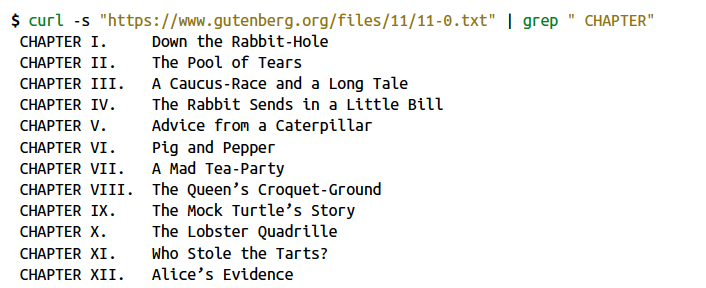

# Command Line Practice

_This tutorial is based on materials from the book [Data Science at the Command Line](https://www.datascienceatthecommandline.com/)._

The command line allows us to perform different operations to **obtain**, **process**, or **manipulate** data.

Below is a list of common commands-line programs:

* `pwd`: get the name of the current directory (i.e. print working directory);
* `cat <file>`: get the contents of a file;
* `cp <source> <destination>`: copy a source to a destination;
* `grep '<pattern>' <file>`: match the given pattern in the contents of a file;
* `sed 's/word1/word2/' <file>`: modify the occurrence of one term by another, in a given file;
* `curl <url>`: get the contents of the remote source identified by the URL;
* `man <command>`: display the manual page for the given command;
* (...)

The Unix philosophy emphasizes combining simple and extensive commands to create complex processes. A central piece of this approach is the adoption of the _pipe and filter pattern_ to divide a large complex task into a sequence of smaller, independent steps (filters) connected by channels (pipes).

Unix commands are connected by _standard input_ (stdin) and _standard output_ (stdout). The default _stdin_ is the keyboard, and the default _stdout_ is the terminal.

We can _join_ programs together by using the _pipe command_ (`|`). In the following example, the contents of a file are printed alphabetically ordered by line.

```bash
cat myfile.txt | sort
```

It is also possible to _redirect_ input with the `<` command or redirect output with `>`. You can append using `>>`. The following example lists the contents of the current directory to a file, overriding the file if it already exists.

```bash
ls > directory_list.txt
```

The following image illustrates a process where the file available at a given URL is downloaded, then filtered considering a given pattern, and finally presented on the terminal.



## Using a Docker image to setup command-line tools 

Unix comes with several command-line tools preinstalled. You can install most of these packages or tools yourself in your environment/operating system. However, in this course, we will use some commands that aren't available in every operating system. So, we encourage you to install the Docker image references below (whether you are on Windows, macOS, or Linux). 

This image was developed by Jeroen Janssens for the book [Data Science at the Command Line](https://www.datascienceatthecommandline.com), from O'Reilly.

To install the Docker image, you first need to download Docker from its [website](www.docker.com). Once it is installed, you should invoke the following command:

```bash
docker pull datasciencetoolbox/dsatcl2e
```

Then, you should run the Docker image using:

```bash
docker run --rm -it datasciencetoolbox/dsatcl2e
```

To exit the container simply use `exit` or `Ctrl+D`.

You can access your local files inside the Docker container by adding a volume that maps your current directory to a directory inside the container. With the following commands, the volume will be mapped at the root level in `/data`.

On macOS or Linux use the command:

```bash
docker run --rm -it -v "$(pwd)":/data datasciencetoolbox/dsatcl2e
```

On Windows, use:

```bash
docker run --rm -it -v "%cd%":/data datasciencetoolbox/dsatcl2e
```

If you prefer not to use this Docker image, you can use your own setup, and then manually install the tools or packages as needed

_If you are on Windows, you migh need to use an Unix terminal emulator._


## Tasks

Attached to this guide is a file named `example.txt`. Bear in mind that you may need more commands than the ones already described.

* **Task 1:** Print the first 10 lines of the file using the `sed` command;

* **Task 2:** Replace the word _"light"_ with _"dark"_;

* **Task 3:** Print all the lines that contain numbers.