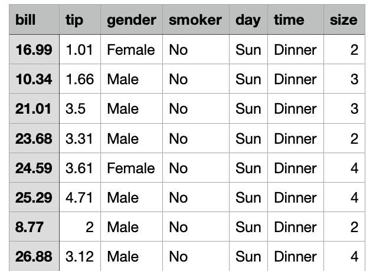

# Datasets

_This tutorial is based on materials from the book [Data Science at the Command Line](https://www.datascienceatthecommandline.com)._

In this tutorial you will explore reading data from different sources, such as **Microsoft Excel**, **CSV**, and **Relational Database** files. Next, we illustrate how to **obtain**, **process**, and **manipulate** data saved in these specific file formats.

The following commands expect the use of the Docker image mentioned in the previous tutorial - [Command Line Practice](../01-command-line).

Most commands used are from the [csvkit suite](https://csvkit.readthedocs.io/en/latest/).


## CSV Dataset

**CSV** is a text-based open file format commonly used in data pipelines. In this example we see how to obtain a `CSV` file from an `XLS` (**Microsoft Excel Spreadsheet**).

To read a `XLS` and output a `CSV`, you should use the command: 

```bash
in2csv <file.xlsx> > <file.csv>
```

You can parse a `CSV` file to keep only selected columns. Using the `-c` in the `csvcut` command as shown next:

```bash
csvcut -c <rows> < <file.csv>
```

The following image illustrates an example of the previous command being executed.


Using the option `-c`, you can select the columns specified. However, if you use the option `-C` (uppercase), you only want to look for all the columns different from the ones specified on the command. The following illustrates an example of option `-C` being used in the `csvcut` command.


To filter the data provided by the `CSV` file, you can use the commands `csvgrep`, `awk`, or `csvsql`.

The following image show the contents of a bills dataset. 



Imagine that you wish to exclude all the bills for which the party size was smaller than five people. To do so, you can use the command `csvgrep`: 

```bash
csvgrep -c size -i -r "[1-4]" tips.csv
```

Now, imagine that you wish to list all the bills above \$10 on a Saturday or Sunday. In this case, you can use the command `awk`:

```bash
tips.csv awk -F, 'NR==1 || ($1 > 10.0) && ($5 ~ /^S/)'
```

You can also use the command `csvsql` to execute the previous action. With `csvsql`, you can use the names of the columns instead of their indexes:

```bash
csvsql --query "SELECT * FROM tips WHERE bill > 10 AND day LIKE 'S%'" tips.csv
```


## Manipulating a Relational Database

You can also use a relational database to maintain the data needed for your projects. As it happens with the Microsoft Excel Spreadsheets and CSV files, you can also obtain and manipulate data from the relational databases from the command line.

For example, to connect to a SQLite database, you could use the command: 

```bash
sql2csv --db 'sqlite:///<DB_name>'
```

To execute a `SQL` query, you can use the command: 

```bash
sql2csv --db 'sqlite:///<DB_name>' --query <QUERY>
```

The following image illustrates this scenario.


_If you are using a local database, you only need to specify its name. However, if you try to access a database outside your local domain, you need to specify any `username`, `password`, or `host` required_.


## Tasks

Below are some tasks that require the manipulation of CSV files. To do these tasks you should use the attached file [example.xlsx](example.xlsx). 
 
* **Task 1:** Obtain a `csv` file from the `example.xlsx` file;
* **Task 2:** Print the data of the last column of the `csv` file;
* **Task 3:** Print all lines that contain a **'y'** in the first column, and count these occurrences (_hint_, to count lines, you can use the command _`wc`_).