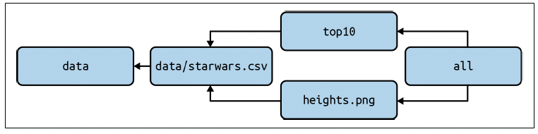

# Shell Scripts and Makefiles

_This tutorial is based on materials from the book [Data Science at the Command Line](https://www.datascienceatthecommandline.com)._


To execute several commands, we can use **makefiles** or **shell scripts**.

## Makefiles

The `make` command is commonly used to specify complex software building processes by defining which commands to execute and the required dependencies. This underlying logic can be used to organize data processing pipelines. The starting point is the definition of _rules_ in a `Makefile`. Each _rule_ defines a list of _targets_, an optional list of _dependencies_, and a list of commands to execute.

```bash
target [target ...]: [component ...]
    [command 1]
    ...
    [command n]
```

Note that each command must be preceded by a `TAB` (not spaces) to be associated with a target.

A target is built with the command `make target`. This results in the execution of the associated commands if the dependencies are verified (i.e., if the files exist). If not, each dependency is called, recursively.

Consider and test the following example.

```bash
.PHONY: alice.csv

output: alice.csv

alice.csv: alice.txt
    cat alice.txt | tr ' ' ',' > alice.csv

alice.txt:
    curl "https://www.gutenberg.org/files/11/11-0.txt" > alice.txt
```

In this example, three targets are defined: _output_, _alice.csv_, and _alice.txt_. With the command `make output`, the target `output` is built, but only if its dependencies are verified. So the target `alice.csv` is built, which first requires the target `alice.txt`.

You can declare rules that are always executed by using a special target called `.PHONY` at the top of your Makefile, followed by the names of the _phony targets_. In the previous example, the rule `alice.csv` is always executed.

Next is an example of a more complex Makefile.

```bash
───────┬────────────────────────────────────────────────────────────────────────
│ File: Makefile
───────┼────────────────────────────────────────────────────────────────────────
 1 │ SHELL := bash
 2 │ .ONESHELL:
 3 │ .SHELLFLAGS := -eu -o pipefail -c
 4 │
 5 │ URL = "https://raw.githubusercontent.com/tidyverse/dplyr/master/data-ra │ w/starwars.csv"
 6 │
 7 │ .PHONY: all top10
 8 │
 9 │ all: top10 heights.png
10 │
11 │ data:
12 │ 	mkdir $@
13 │
14 │ data/starwars.csv: data
15 │ 	curl -sL $(URL) > $@
16 │
17 │ top10: data/starwars.csv
18 │ 	grep Human $< |
19 │ 	cut -d, -f 1,2 |
20 │ 	sort -t, -k2 -nr |
21 │ 	head
22 │
23 │ heights.png: data/starwars.csv
24 │ 	< $< rush plot --x height --y species --geom boxplot > $@
───────┴────────────────────────────────────────────────────────────────────────
```

The following image shows the dependencies between targets of the previous Makefile.




## Template Makefile

A [template Makefile](Makefile.template) is available as a starting point and reference for your project. This template identifies typical tasks found in a data processing pipeline. You should adapt this for your project's specific needs.


## Shell scripts

You can execute all the previous commands using a **shell script**. However, in this course, you will need to use a Makefile to organize your **data pipeline**, and to use scripts to **process data**.

Below is an example of a **script** that executes a sequence of Unix commands in a _pipe and filter_ fashion. You can create scripts in any programming language.

```bash
#!/usr/bin/env bash
curl -s http://www.gutenberg.org/cache/epub/76/pg76.txt |
tr '[:upper:]' '[:lower:]' |
grep -oE 'Äw+' |
sort |
uniq -c |
sort -nr |
head -n 10
```

## Tasks

Next, you have two different tasks related to the use of Makefiles and shell scripts.


### Task 1

You should create a **Makefile** that reads the content of the file `example.txt`, parses each URL listed (one per line), and creates individual `.html` files for each feed item.


### Task 2

The attached [Makefile](Makefile.sigarra) downloads the list of **LEIC** and **MEIC** courses from SIGARRA. So far, this Makefile reads the HTML of each course. However, it needs a shell script called `parse-program-html.sh` so that it is possible to know the **id** and **name** of each course (which will be later written in a `.tsv` file). 

Note that you can specify which Makefile file to use with the `-f` parameter, e.g. `make -f Makefile.sigarra`.

Therefore, you should develop a `parse-program-html.sh` file that:

1. Reads the `.html` created for each program;
2. Checks the different courses in each file;
3. Extracts the **id** and **name** of each course;
4. Sorts the occurrences alphabetically.

***Hint:***

1. You can insert a **newline** after each `</td>` element so that each course represents an independent line on the `.html` file;
2. You can use `sed` to extract the **id** and **name** of each course.
