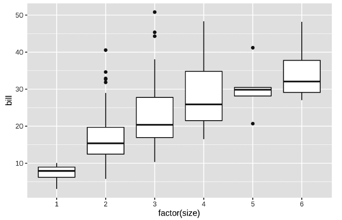

# Data Characterization

To characterize data or to know more about it, you can measure specific statistical values or you can use visual methods to observe certain details.

_This tutorial is based on materials from the book [Data Science at the Command Line](https://www.datascienceatthecommandline.com)._


## Statistical Analysis

Most of the time, you will need to compute specific statistics related to certain features. To do it, you can use the command line, through the command `csvstat`. For each feature (column), `csvstat` shows:

* The data type;
* Whether it has any missing values (nulls);
* The number of unique values;
* Various descriptive statistics (minimum, maximum, sum, mean, standard deviation, and median) for those features for which it is appropriate.

Example: `csvstat venture.csv | trim 32`


If you’re only interested in a specific statistic, you can use one of the following options:

* --max (maximum)
* --min (minimum)
* --sum (sum)
* --mean (mean)
* --median (median)
* --stdev (standard deviation)
* --nulls (whether a column contains nulls)
* --unique (unique values)
* --freq (frequent values)
* --len (maximum value length)

Example: `csvstat venture.csv --freq`


You can also select a smaller subset of features using the option `-c`, which accepts both integers (the column number) and column names:

Example: `csvstat venture.csv -c 3, GEO`


You can also perform statistical exploration using **R** or **Python**.


### Programming with R

[**R**](https://www.r-project.org/) is a popular statistical software package. To start R, you should run the command: `R --quiet` (`--quiet` to suppress the startup message). Then, you will have access to an interactive command line interface.

Imagine that you want to create a new column with a new statistical property. To do so, you should:

1. Load any required packages, using the command `library(lib_name)`;
2. Read the CSV file and assign it to a variable, using the command `df <- read_csv("csv_file")`;
3. Compute the new column that you wish, using the command `df <- mutate(df, new_column = rule_to_compute)` (i.e., `df <- mutate(df, new percent = tip / bill * 100)`);
4. Save the result to disk, using the command `write_csv(df, "new_csv_file")`;
5. Exit R, using the command `quit()` or simply `q()`.

You can simplify this set of actions using the command `rush` (outside the R interactive session). With `rush`, you can reduce the code that you need to perform a specific action. For instance, the commands 2, 3, and 4 can be reduced to only:

```rush run -t 'mutate(df, new_column = rule_to_compute)' csv_file > new_csv_file```

To know more about `rush`, run the command `rush run --help`.

As already said, you can assess specific statistics using R. Imagine that you have a dataset named __iris__ with the following structure, and you want to obtain base statistics about it.


Here's some example commands to do it:

* Number of Rows: `nrow(dataset)` (i.e. `nrow(iris)`);
* Number of Rows per Feature: `count(dataset, feature)` (i.e. `nrow(iris, Species)`);
* Mean Value: `mean(dataset$feature)` (i.e. `mean(iris$Sepal.Length)`);
* Variance: `var(dataset$feature)`;
* Standard Deviation: `sd(dataset$feature)`;
* Standard Error: `sd(dataset$feature)/sqrt(count(dataset, feature))`;
* Median Absolute Deviation from the Median: `mad(dataset$feature)`;
* Median: `median(dataset$feature)`;
* Minimum: `min(dataset$feature)`;
* Maximum: `max(dataset$feature)`:
* Quantile: `quantile(dataset$feature, c(<quantiles expected>))` (i.e., `quantile(iris$Sepal.Length, c(0.25, 0.5, 0.75))`);


### Programming with Python

[**Python**](https://www.python.org/) is a popular programming language that can be used from _web development_ to _advanced mathematical computation_.

Python can also be used to measure specific statistics, using the `pandas` package. To use it, you import the package using `import pandas as pd`.

Imagine that you have a dataset named `titanic.csv`, with the following structure:


First, you should read the dataset using `titanic = pd.read_csv("titanic.csv")`. Then, you can start analyzing some statistical values, like:

* Mean Value of a Feature: `dataset_variable[feature].mean()` (i.e., `titanic["Age"].mean()`);
* Median: `dataset_variable[feature1, …, featureN].median()` (i.e., `titanic[["Age", "Fare"]].median()`);
* More Important Statistics of a Feature: `dataset_var[[feature1, …, featureN]].describe()` (i.e., `titanic[["Age"]].describe()`);


You can also aggregate the values by group (e.g., aggregate them by gender). To do so, you should use the function `groupby`.

Example: `titanic[["Sex", "Age"]].groupby("Sex").mean()`


## Data Visualization

You can generate plots based on your data using either **R** or **Python**.

Using **R**, you can use `rush` to display the images. With rush, you can display images using `ggplot2`, a visualization package for R.

Example: `rush run --library ggplot2 'ggplot(df, aes(x = bill, y = tip, color = size)) + geom_point() + facet_wrap(~day)' tips.csv > tips.png`

However, you can also use the command `plot` (with plot, you don't need to learn R and the grammar of graphics).

Example: `rush plot --x bill --y tip --color size --facets '~day' tips.csv > tips.png`

Using **Python**, you can use the packages `pandas`, `matplotlib`, and `numpy`.

Example:
```python
df = read_csv("tips.csv")
df.plot()
```


### Bar Chart

Bar charts can be used to display the value measured for a categorical feature.

Example with `ggplot`:

```rush run --library ggplot2 'ggplot(df, aes(x = time, fill = time, color = size)) + geom_bar()' tips.csv > plot-bar.png```

Example with `plot`:

```bash
rush plot --x time tips.csv > plot-bar.png
```

Example with `python`:

```python
df['time'].plot(kind='bar')
```


### Histograms

The counts of a continuous variable can be visualized with a histogram. 

Example with `plot`:

```rush plot --x tip --fill time tips.csv > plot-histogram.png```


### Density Plots

A density plot can be used to visualize the distribution of a continuous variable in a smoother way than a histogram.

Example with `plot`:

```rush plot --x tip --fill time --geom density tips.csv > plot-density.png```


### Box Plots

A box plot includes, for one or more features, the minimum, the maximum, the sample median, and the first and third quartiles.

Example with `plot`:

```rush plot --x 'factor(size)' --y bill --geom boxplot tips.csv > plot-boxplot.png```




## Prepare tables for LaTeX

Imagine that you wish to convert a table with statistics measured using R or Python into a table in LaTeX. You can do it by implementing a small block of code:

Example using R:

```r
library(foreign)
library(xtable)
library(stargazer)

dataset <- read.csv("file.csv", header = TRUE)
new <- dataset[c("column1", "column2", "column3", "column4", "column5")]
new2 <- new[1:243, 2:5]
fa1 <- factanal(new2, factors = 4, rotation = "varimax", sort = TRUE)
print(fa1, digits = 3, cutoff = .5, sort = TRUE)

newobject2 <- as.data.frame(unclass(fa1$loadings))
print(xtable(newobject2, type = "latex"), file = "filename.tex")
```

Example using Python:

```python
import pandas as pd
df = pd.DataFrame(['column1','column2','column3'])
with open('mytable.tex','w') as tf:
    tf.write(df.to_latex())
```

## Tasks

In the following tasks, you should use the attached file `example.csv`. You can use the command line, R, or Python to solve them.

* **Task 1:** Read the information of each odd column;

* **Task 2:** Read only the standard deviation, maximum, and minimum values of each even column;

* **Task 3:** Create a bar chart showing the difference between male and female customers;

* **Task 4:** Show the difference of tips over the different meal times.
