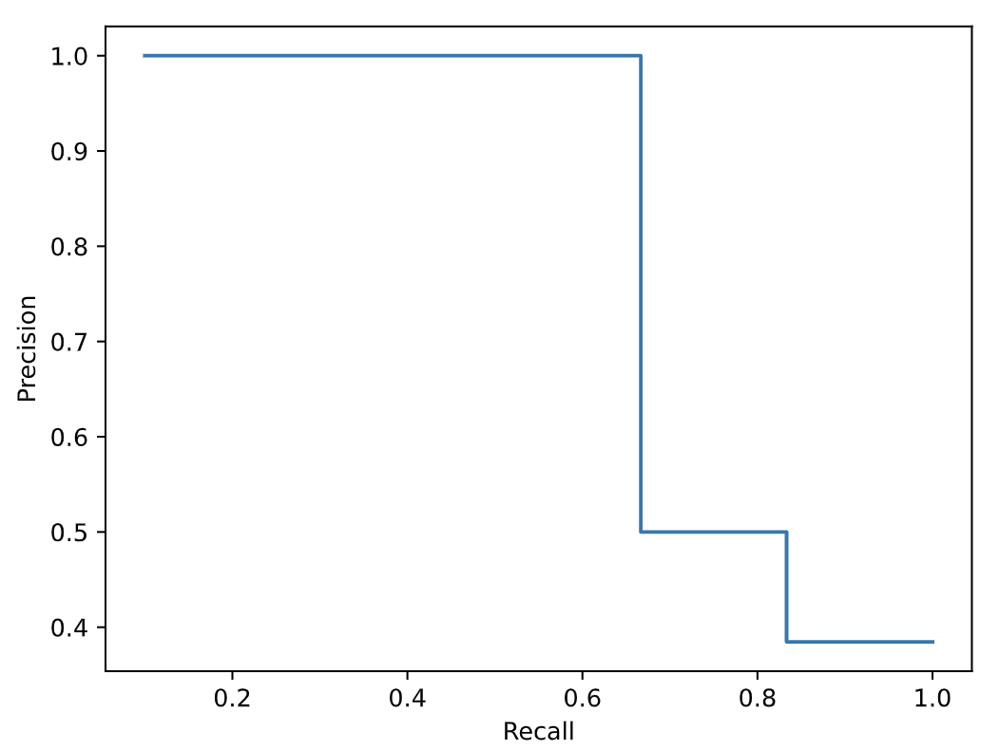
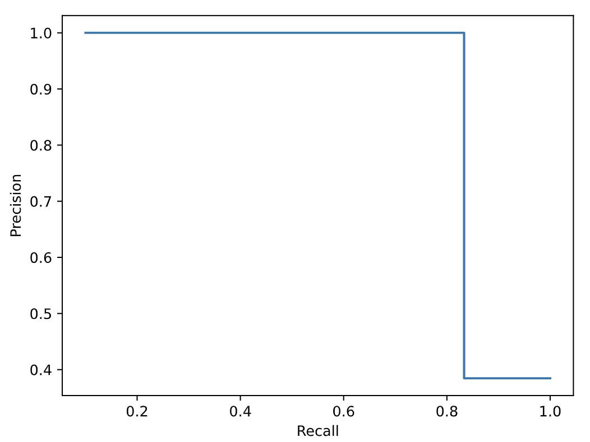

# Search Results Evaluation

With your search system up and running, we can execute queries with the aim of satisfying certain information needs.
At this stage, it is important to evaluate the results obtained in a systematic way, so that we can have a more objective picture of the performance of our system, as well as compare different versions of the same base system.

In this small tutorial, we will go over the evaluation process.
More specifically, we'll go over relevance judgements, ways of (semi-)automating these judgements, and common evaluation metrics used.

## Relevance Judgements

Evaluation in Information Retrieval systems is centered around the concept of relevance.
A document is deemed as relevant if it satisfies the query's underlying topic or information need.
This can be highly subjective and, therefore, evaluating a system isn't always an easy task.

One of the most common evaluation approaches relies on *test collections*.
A test collection is a set of resources that includes the corpora indexed by the system, one or more topics (information needs), and a matrix of relevance judgements between both (usually translated into a list of relevant documents per topic; these lists are often called *qrels*).
By incorporating evaluation metrics over the results obtained, one can then compare different retrieval strategies and algorithms in a systematic manner.

In real-world scenarios, such as TREC conferences, these test collections are constructed with the collaboration of several independent researchers over a larger period of time, and go into great detail.
In this course, we need to simplify requirements.
More specifically, we will be building the system, as well as these collections, so there won't be any conflicts in terms of relevance assessment, and might not need to have a relevance judgement for every document in every topic.
In other words, assessing relevance, e.g., for 6 queries in a system with a few tens of thousands of documents quickly leads to a workload out of control.
Moreover, while it is possible to have graded relevance, we'll stick to a binary format: either the document is relevant, or it isn't.

Picking up once again on our [MEIC courses dataset](meic_courses.json) and [Schema](simple_schema.json) from [tutorial 5](../05-solr), we'll use a single, simple topic to illustrate the process.
Our underlying information need is to find **courses in the Information Systems scientific area**.

Since our collection is small, we can easily assess relevance for all its documents.
Below are the relevant ones, producing our version of a *qrels*.
They are identified by their course ID, which is an easy way to automate evaluation later.
```bash
# information_systems_qrels.txt
# A relevance judgment can be as simple as this,
# a list of relevant documents for a given topic/need/query
M.EIC003 # Information Processing and Retrieval (PRI)
M.EIC047 # Semantic Web and Linked Data (WSDL)
M.EIC031 # Data Analysis and Integration (ADI)
M.EIC028 # Database Technologies (TBD)
M.EIC032 # Non Relational Databases (BDNR)
M.EIC019 # Information Systems Management (GSSI)
```

For your project, you could adopt a similar organization, with one file per query/information need.

## Evaluation Metrics
Evaluation measures provide a way of quantifying retrieval effectiveness.
Individual metrics are prone to bias and giving a tunnelled vision of the system.
Therefore, it is important to always evalue over a set of distinct metrics.

**Precision** and **recall** are the two most well-known measurements and, when calculated globally, ignore the ranking of the relevant documents returned.
Precision measures the fraction of relevant retrieved documents, i.e., it is the ratio between the number of relevant documents and the total number of documents retrieved.
A system that returns 20 documents for a particular search, with 5 of those being relevant, has a precision of 25%.
Recall, on the other hand, measures the fraction of retrieved relevant documents, i.e., what proportion of all the relevant documents has been retrieved.
For the same system, if we knew there were, in total, 10 relevant documents, then the recall would be 50%.

Precision and recall tend to vary inversely: higher precision is often coupled with lower recall. 
Therefore, they are often presented together, since it's also dependent on the system's goal (i.e., is it more important to have a few, relevant search results near the top, or to have all relevant documents returned, whatever the ranking?).
There even exist some metrics to combine their values (e.g., the [f-score](https://en.wikipedia.org/wiki/F-score)).

Calculating recall accurately requires comparing the set of retrieved documents with the entire collection, which is impossible in many cases (e.g., Web search, and certainly most projects in this course).
If you still wish to incorporate recall metrics in your project, you can use strategies such as *pooling*, where recall is evaluated over a subset of the whole collection instead.

Despite their relative expressiveness, ranking cannot be ignored when evaluating search results.
Therefore, there are metrics that are the output of adapting precision and recall measurements to specific levels of the returned document set.
A common evaluation includes [precision-recall curves](https://scikit-learn.org/stable/auto_examples/model_selection/plot_precision_recall.html), i.e., a plot that traces the evolution of the system's precision as recall increases.
This allows us to observe the tradeoff between the metrics at certain thresholds.
The area under the curve is considered a measurement of the system's quality: a bigger area means that the system was able to keep a higher overall precision (in contrast, a lower area would mean that a system is able to return many results, but few relevant ones).
The steps for each axis are usually of 0.1.

Other metrics that incorporate ranking include Precision at N (P@N) and (Mean) Average Precision ((M)AP).
The former calculates Precision at a specific cut point in the result ranked list, with the most common value being N=10, producing Precision@10.
On the other hand, the *Mean Average Precision* is the result of the average of another metric applied at query level, *Average Precision (AP)*, a metric regarded as very stable.
For a given query, its AP is defined as the average of the precision values obtained for the set of top N documents existing each time a new relevant document is retrieved.
As an example, for a given query whose correct results were returned on the 1st, 3rd and 10th positions, its AP would be (1/1 + 2/3 + 3/10) / 3 ~ 0.66.
The MAP is often used to compare different systems.

There are, naturally, other evaluation metrics not covered here.
You should explore what better fits the kind of search system your project is gearing towards so that, ultimately, you can adequately judge its performance, not only by itself, but also when compared to modified versions (Milestone 3).

## Putting it Together
With an idea on how to organize judgement assessments and metrics that we can use, we're ready to evaluate our search system and even make comparison between different implementations over it.
This can be somewhat automated in order to reduce toil.
Recall from the previous tutorial that Solr's interface shows the REST API endpoint for each query you build on the UI.
This is our starting point.

Our two systems here will be represented by querying same information need in two different levels of details.
The first one queries the keyword `[ informação ]` over the textual fields present in the documents (`title`, `objectives` and `learning_outcomes`), using the *eDisMax* query parser, while the second does all that, but also boosts matches on the title field by a factor of 2, as well as provides an independent boost to documents that contain the term `[ dados ]` in the course title, a term often associated with courses in the area we're interested in.

The example Python script below, split in three main parts, fetches query results over Solr's REST API and calculates some metrics mentioned previously automatically based on our version of the *qrels*, and also traces a precision-recall curve.

In the first part, we import necessary modules, read the *qrels* file and fetch query results from Solr's REST API.
For different queries/systems, the `QUERY_URL` will vary, of course.

In our context, a search for `informação` would have the following endpoint URL — `http://localhost:8983/solr/courses/select?q=title%3Ainforma%C3%A7%C3%A3o&wt=json`.


```python
# SETUP
import matplotlib.pyplot as plt
from sklearn.metrics import PrecisionRecallDisplay
import numpy as np
import json
import requests
import pandas as pd

QRELS_FILE = ...
QUERY_URL = ...

# Read qrels to extract relevant documents
relevant = list(map(lambda el: el.strip(), open(QRELS_FILE).readlines()))
# Get query results from Solr instance
results = requests.get(QUERY_URL).json()['response']['docs']
```

In a second step, we calculate some common evaluation metrics that can be used to compare systems.
In order to better automate the process, in Python, we can define a custom decorator that, based on a metric key, performs the adequate calculation.
The entry point will be the `calculate_metric` function, which takes, apart from the metric key, the search system's result list, as well as the relevant document identifiers.
In this case, we stick to *Average Precision* and *Precision at 10 (P@10)* only, for simplicity.
Their implementation functions simply instantiate what we described before.
Finally, we collect the values and export them in a LaTeX table, in a similar manner to [tutorial 4](../04-data-characterization), ready to be used in our report.

```python
# METRICS TABLE
# Define custom decorator to automatically calculate metric based on key
metrics = {}
metric = lambda f: metrics.setdefault(f.__name__, f)

@metric
def ap(results, relevant):
    """Average Precision"""
    precision_values = []
    relevant_count = 0

    for idx, doc in enumerate(results):
        if doc['id'] in relevant:
            relevant_count += 1
            precision_at_k = relevant_count / (idx + 1)
            precision_values.append(precision_at_k)

    if not precision_values:
        return 0.0

    return sum(precision_values)/len(precision_values)

@metric
def p10(results, relevant, n=10):
    """Precision at N"""
    return len([doc for doc in results[:n] if doc['id'] in relevant])/n

def calculate_metric(key, results, relevant):
    return metrics[key](results, relevant)

# Define metrics to be calculated
evaluation_metrics = {
    'ap': 'Average Precision',
    'p10': 'Precision at 10 (P@10)'
}

# Calculate all metrics and export results as LaTeX table
df = pd.DataFrame([['Metric','Value']] +
    [
        [evaluation_metrics[m], calculate_metric(m, results, relevant)]
        for m in evaluation_metrics
    ]
)

with open('results.tex','w') as tf:
    tf.write(df.to_latex())
```
As a last step, we calculate a precision-recall curve, to provide a more visual clue about the systems' performance.
We start by calculating precision and recall values at all the ranking positions (e.g., we are, in fact, calculation Precision@N several times).
However, in order to produce a smoother curve and plot, we extend these generated breakpoints to also include missing steps in the more common intervals (0.1, 0.2 ...).
We do this by associating the new steps' values to the one either immediately before or after to fill in the gaps.
Finally, by using `sklearn`'s `PrecisionRecallDisplay`, we quickly get our plot.

```python
# PRECISION-RECALL CURVE
# Calculate precision and recall values as we move down the ranked list
precision_values = [
    len([
        doc 
        for doc in results[:idx]
        if doc['id'] in relevant
    ]) / idx 
    for idx, _ in enumerate(results, start=1)
]

recall_values = [
    len([
        doc for doc in results[:idx]
        if doc['id'] in relevant
    ]) / len(relevant)
    for idx, _ in enumerate(results, start=1)
]

precision_recall_match = {k: v for k,v in zip(recall_values, precision_values)}

# Extend recall_values to include traditional steps for a better curve (0.1, 0.2 ...)
recall_values.extend([step for step in np.arange(0.1, 1.1, 0.1) if step not in recall_values])
recall_values = sorted(set(recall_values))

# Extend matching dict to include these new intermediate steps
for idx, step in enumerate(recall_values):
    if step not in precision_recall_match:
        if recall_values[idx-1] in precision_recall_match:
            precision_recall_match[step] = precision_recall_match[recall_values[idx-1]]
        else:
            precision_recall_match[step] = precision_recall_match[recall_values[idx+1]]

disp = PrecisionRecallDisplay([precision_recall_match.get(r) for r in recall_values], recall_values)
disp.plot()
plt.savefig('precision_recall.pdf')
```

Coming back to our specific example, here are the ranked result lists for each one:

| Rank | Base system | Enhanced system |
| - | - | - |
| 1 | M.EIC003 | M.EIC003 |
| 2 | M.EIC019 | M.EIC019 |
| 3 | M.EIC047 | M.EIC047 |
| 4 | M.EIC032 | M.EIC032 |
| 5 | M.EIC026 | M.EIC031 |
| 6 | M.EIC014 | M.EIC026 |
| 7 | M.EIC029 | M.EIC014 |
| 8 | M.EIC024 | M.EIC029 |
| 9 | M.EIC031 | M.EIC024 |
| 10 | M.EIC042 | M.EIC042 |
| 11 | M.EIC039 | M.EIC039 |
| 12 | M.EIC016 | M.EIC016 |
| 13 | M.EIC008 | M.EIC008 |

Applying the previous script to both of our cases, we get the evaluation metrics below.

| System/Metric | Average Precision | Precision at 10 |
|--------------|-----------|------------|
| Base | 0.91 | 0.5 |
| Enhanced (boosts) | 1.0 | 0.5 |

We can see the difference in performance, but also some similarities: both systems had an equal *Precision at 10*.
Indeed, both presented 5 of the 6 relevant results in their top 10 retrieved documents.
However, when also measuring *Average Precision*, we see that the enhanced system performed better, as the relevant results were, on average, placed higher on the ranked list.
For a different perspective, let's look at the precision-recall curves.

| Base system | Enhanced system |
| - | - |
|  |  |

Once again we see how the boosting led to better results, resulting in a precision-recall curve that declines in a slower manner, showing the importance of a fine-tuned query/system.
