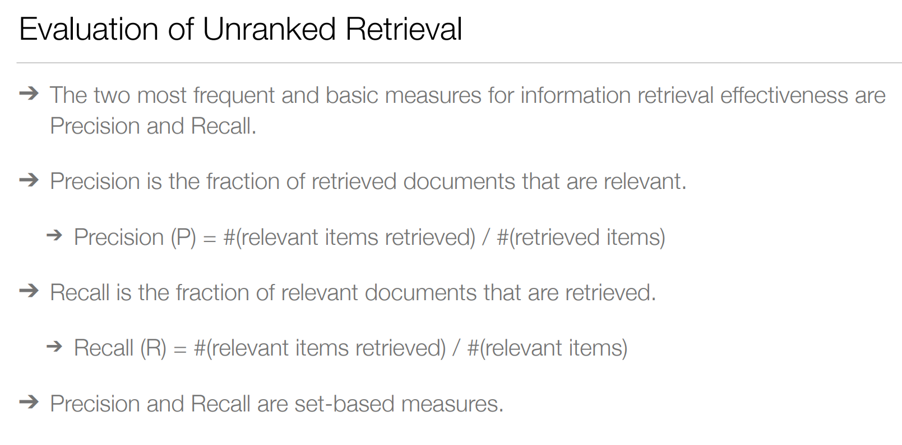

# Notes

Consists of random notes, thoughts which could be useful for the final exam.

## 1. [Introduction](./pri2324-01-intro.pdf)

The information life cycle is the **continuous** process of creating/generating, collecting, recording/storing, processing, distributing/transmitting, consuming/using and disposing of information.

Information Retrieval is the CS field focused on: finding information that is **relevant** --> to a user's **need**.

Information Access:
- We cannot simply use pattern matching and structured queries (e.g. SQL) to find information.
- **Information Retrieval** != Data Retrieval:
    - Not limited to exact matching (e.g. multiple words, synonyms, etc.);
    - Is ordered by relevance, i.e. the most relevant documents are shown first according to the user's query.

**Ad Hoc Search** is the most common type of search, where the user is looking for information on a specific topic.

**Vertical Search** focuses on a specific domain, e.g. searching for a specific product on Amazon. The results aren't limited to "documents", e.g. a game result, a product, etc.

**Enterprise Search** is a type of search that is performed on a company's intranet, e.g. searching for a document.

**Desktop Search** is a type of search that is performed on the user's computer, e.g. searching for a file.

## 2. [Data Collection](./pri2324-02-data-collection.pdf)

Starting with the terminology:
- **Data**: is a collection of facts; measurement of something on a scale;
- **Metadata**: is data about data, e.g. the date of creation of a file, author, etc.;
- **Information**: is data that has been processed and has meaning --> it is useful;

Regarding the **value** in **Data**, it is considered to be the new Oil, i.e. it is a valuable resource that can be used to generate value. Also, we can **increase** the value of data by combining, cleaning, processing... etc.:
- **Indirect Value**: provides insights into the user's behavior, e.g. purchasing habits;
- **Direct Value**: the data itself is valuable, e.g. a product recommendation system;

The primary blocks in data-intensive systems include:
- Where and how to store the data efficiently (databases);
- Cache expensive operations;
- Enable search and filtering (indexing);
- Stream messages between systems;
- Periodically process data (batch processing);

## 3. [Data Preparation](./pri2324-03-data-preparation.pdf)

Once more, Ad Hoc Search is the most common type of search, where the user is looking for information on a specific topic.

Regarding Data Preparation, up to 80% of the time spent, are in data preparation tasks. We have the following stages:
- **Cleaning**
- **Transformation**, which includes:
    - Normalization (e.g. converting to lowercase);
    - Scaling values to a specific range (e.g. 0-1);
    - Encoding (e.g. one-hot encoding);
    - Binning (e.g. grouping values into bins of size X);
- **Synthetization** of new data (e.g. combining two columns into one);
- **Integration** (e.g. combining data from multiple sources);
- **Reduction** (e.g. removing outliers, redundant or even not useful data). Includes:
    - Filtering
    - Sampling
    - Aggregation

After preparing the data (and even while preparing it), we **should/must** explore it, e.g. using visualizations.

Finally, it's optimal to consider a Data Pipeline as a best practise when dealing with data. It should be:
- Reliable, Scalable and Maintainable;

Regarding the documentation of a pipeline, its important to consider the following notions:
- **Squares** represent external sources of data;
- **Rounded Rectangles** represent data processing steps;
- **Arrows** represent the flow of data;
- **Open-ended Rectangles** represent the final output of the pipeline (e.g. a database or a file);

## 4. [Data Processing](./pri2324-04-data-processing.pdf)

Data Models are used not only to display how the software is structured, but also on how we think about the problem at hand (the kind of data we are dealing with). They define abstractions that allow us to reason about the data and the operations that we can perform on it. These are some examples of models:
- **Relational Model** (e.g. SQL);
- **Document Model** (one-to-many relationship between records, e.g. NoSQL - MongoDB);
- **Graph Model** (App has mostly many-many relationships, which represents a tree-like structure, e.g. social graphs, web graph, transportation networks, etc. --> Neo4j). A good thing about graphs is they do not require homogeneous data, i.e. the linked nodes do not need to have the same type of attributes.
    - **Triple-Store Model** Is similar to the Graph Model, *(subject, predicate, object)* is the same on a Graph model of having two vertexes *(subject, object)* (**attention**, *object* can also be a value) and an edge *(predicate)*. The difference is that the Triple-Store Model is more focused on the relationships between the nodes, while the Graph Model is more focused on the nodes themselves.

There are 3 main approaches to data processing:
- **Batch Processing/Offline Systems** - suitable for long jobs or async processes --> can be a logging of a large amount of data;
- **Services/Online Systems** - suitable for short jobs or sync processes --> requires a fast response time;
- **Stream Processing** - service operates on inputs and produces output, which is the result of an event happening --> e.g. a stock price change;

Finally, it is important to visualize all this data, using, for example, word clouds, histograms, scatter plots, etc.

## 4.2. [Applied NLP for Information Retrieval](./pri2324-04-nlp-for-ir.pdf)

NLP is used to extract information from text, which can be useful to improve the search results. These are the tasks used for Information Retrieval:
- **Tokenization** - split text into tokens (words, sentences, etc.);
- **Stemming & Lemmatization** - reduce words to their root form (e.g. *running* --> *run*) & reduce words to their dictionary form (e.g. *better* --> *good*);
- **Part-of-Speech Tagging** - assign a part-of-speech tag to each token (e.g. noun, verb, etc.);
- **Named Entity Recognition (NER)** - find named entities in text (e.g. people, places, enterprises etc.);
- **Syntactic Analysis** - analyze the grammatical structure of a sentence (e.g. parse tree);
- **Information Extraction** - allows to extract structured information from unstructured text (e.g. dates, locations, etc.);
- **Relation Extraction** - allows to extract relations between entities (e.g. *Bill Gates* is the *founder* of *Microsoft*);
- **Sentiment Analysis** - allows to understand the sentiment of a text (e.g. positive, negative, neutral);

The order of events are:
- Raw Text > Tokenization > Syntax Analysis > Semantic Analysis > NER > Sentiment Analysis > Information Extraction > Meaning

Text Representations (using as example the phrase - *'Good dog, good dog!', said the quick brown fox.*):
- **Bag-of-Words** - each document is represented as a bag of words (i.e. a set of words) *{ "good": 2, "dog": 2, "said": 1, "the": 1, "quick": 1, "brown": 1, "fox": 1 }*
    - Advantages: simplicity, efficiency;
    - Disadvantages: ignores word order, ignores semantics, ignores grammar;
- **Term Frequency-Inverse Document Frequency (TF-IDF)** - each document is represented as a vector of TF-IDF values (i.e. a set of words and their frequencies) *{ "Good": 0.2, "dog": 0.3, "said": 0.15, "quick": 0.25, "brown": 0.3, "fox": 0.3 }*
    - Advantages: capture term importance;
    - Disadvantages: ignores word order, ignores semantics, ignores grammar;
- **N-grams** - each document is represented as a set of n-grams (i.e. a set of n consecutive words) *{ "'Good dog,", "dog, good", "good dog!’,", "dog!’, said", "said the", "the quick", 
"quick brown", "brown fox." }*
    - Advantages: takes into account word order, phrase detection;
    - Disadvantages: increased dimensionality and size sensitivity;
- **Vector-Based** - Map each word into a vector with the size of the vocabulary (i.e. one-hot encoding) *good: [ 0, 0, 0, 1, 0, 0, 0 ]; dog [ 0, 1, 0, 0, 0, 0, 0]* it is represented in the document using word frequencies [ 1, 2, 1, 2, 1, 1, 1 ] according to the vocabulary: *[brown, dog, fox, good, quick, said, the]*
    - **Word Embeddings** - each word is represented as a vector of real numbers (e.g. 300 dimensions) *good: [ 0.1, 0.2, 0.3, ..., 0.1 ]; dog: [ 0.2, 0.1, 0.4, ..., 0.2 ]*
        - Advantages: takes into account word order, phrase detection, semantic similarity, reduced dimensionality (which is better than one-hot encoding);

## 5. [Information Retrieval](./pri2324-05-ir-introduction.pdf)

Information Retrieval main Tasks:
- Ad-hoc Search - find relevant documents for a given query;
- Filtering - find relevant user profiles for a new document;
- Classification - identify relevant labels for documents;
- Question Answering - find relevant answers for a given question;

## 6. [Solr](./pri2324-06-solr.pdf)

Solr is a search framework that indexes data and then enables retrieval of that data. It is based on Lucene, which is a Java library for indexing and searching text. Documents are composed of fields, which are composed of terms. Fields can be of different types, e.g. text, date, number... Textual fields go through a pipeline of **analyzers** (generate a token stream), **tokenizers** (character stream produces a sequence of token objects) and **filters** (transform the token stream).

A Solr schema fields can also be:
- **dynamicFields** - fields that are not explicitly defined in the schema, but are created automatically based on a pattern;
- **copyFields** - fields that are automatically populated with the values of other fields --> used to keep the original values for display purposes;

A Solr field, beside the classes mentioned above, can also include:
- **indexAnalyzer** - transformations applied to the field when indexing;
- **queryAnalyzer** - transformations applied to the field when querying, same as indexAnalyzer;
- From the previous 2, they can be:
    - **Tokenizers** - e.g. StandardTokenizerFactory;
    - **Filters** - e.g. ASCIIFoldingFilterFactory LowerCaseFilterFactory, etc...;

Different **Query Parsers** can be used to match documents to a query:
- The **standard query parser** offers an intuitive syntax but is very strict, i.e. is very intolerant to syntax errors. 
- The **DisMax query parser** is designed to through as little errors as possible, being appropriate for consumer facing applications. 
- The **Extended DisMax query parser (eDisMax)** is an improved version that is both forgiving in the syntax and also supports complex query expressions.
- Both **DisMax** and **eDisMax** support **boosting/weighted fields** (e.g. *q=foo^5 bar*), which is a way to increase the score of a document if it contains a specific term.

## 7. [Evaluation](./pri2324-07-ir-evaluation.pdf)

Evaluation depends on the task, collection, information need, etc --> it is the most important part of the IR process:
- Used to undertsand the use of a system by its users;
- Make decisions on new features to implement;
- **Effectiveness** vs **Efficiency** --> find the **right information** vs **how fast** we can **find information** at all;

To measure the **effectiveness** of a system, we need:
- A document collection (corpus);
- A set of queries;
- A set of relevance judgements (for each query, a set of relevant & non-relevant documents);

**Relevance** is assessed relative to an **information need**, not a query:
- (e.g.) Information on whether the **US** should **invade Iraq** --> This may be translated into a query such as **Iraq war**. A query is relevant IF it addresses the information need, not if it matches the query.
- Kinds of relevance can be:
    - **Topical Relevance (aboutness)** - the document is about the topic;
    - **Situation Relevance (utility)** - the document is useful in the current situation;
    - **Cognitive Relevance (pertinence)** - the document is useful for the current task;
    - **Affective Relevance (satisfaction)** - the document is satisfying to the user;

The metrics that are usually used to evaluate a system are:
- **Precision** - the fraction of retrieved documents that are relevant;
    - **P@k** - precision at k, i.e. the precision of the top k documents;
    - **Average Precision (AvP)** - the average of the precision values obtained for each relevant document (AvP = (P1 + P2 + ... + Pn) / n);
- **Recall** - the fraction of relevant documents that are retrieved;
- **F-measure** - the harmonic mean of precision and recall (F1 = 2 * (P * R) / (P + R));
- **Mean Average Precision (MAP)** - the average of the precision values obtained for each query (MAP = (AvP1 + AvP2 + ... + AvPn) / n);
- **Precision-Recall Curves**: 

## 8. [Concepts](./pri2324-08-ir-concepts.pdf)

Ranked Retrieval - with the Boolean model, the documents are either relevant or not: in large documents collections, this is not feasible, so it is important to rank the documents according to their relevance instead